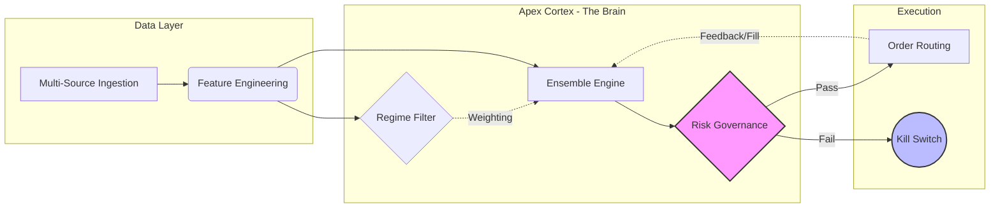

# Itera Dynamics: Quantitative Signal Platform


> **Market-Agnostic Regime-Adaptive Trading Architecture**

---

## 📖 Overview

**Itera Dynamics** is an institutional-grade quantitative research and execution platform designed for non-stationary markets. It features a modular, event-driven architecture that decouples signal generation (`apex_core`) from asset-specific implementations (`moonwire` for crypto, `alpha_engine` for equities).

The system prioritizes **capital preservation** through a closed-loop governance layer, utilizing automated drift detection, volatility gating, and artifact lineage to ensure production safety.

---

## 🏗 System Architecture

The core philosophy is a **Cybernetic Feedback Loop**: signals are not just fired; they are governed, monitored, and used to recalibrate the engine in real-time.



---

## 📂 Project Structure

Itera Dynamics is structured as a modern Python Monorepo, allowing shared logic across asset classes while maintaining strict boundary separation.

```
IteraDynamics/
├── apex_core/                  # 🧠 The Core Library (Asset-Agnostic)
│   ├── auditing.py             # Purged Walk-Forward Analysis (Lopez de Prado)
│   ├── governance.py           # Drift Detection & Kill Switches
│   ├── interfaces.py           # Abstract Base Classes (IBroker, IStrategy)
│   └── paper_broker.py         # State-Persistent Shadow Execution Engine
│
├── moonwire/                   # 🪙 Digital Assets Implementation
│   ├── adapters/               # CCXT/Binance Connectors
│   └── live_engine.py          # 24/7 Event Loop for Crypto
│
├── alpha_engine/               # 📈 Equities Implementation
│   ├── adapters/               # IBKR/Alpaca Connectors
│   └── strategies/             # Equity-Specific Factor Models
│
├── pyproject.toml              # Build System Configuration
└── README.md                   # System Documentation
```

---

## ⚡ Key Capabilities

### 🛡️ 1. Closed-Loop Governance

* **Drift Detection:** Monitors feature importance decay and Sharpe degradation in real-time.
* **Execution Gates:** Pre-trade checks for liquidity, spread, and account health.
* **Global Kill-Switch:** Automated "Shadow Mode" transition if drawdown breaches defined thresholds (Default: -25%).

### 🔬 2. Research Hygiene

* **Purged Walk-Forward Validation:** Implements 7-fold temporal splitting with Embargo Gaps to eliminate look-ahead bias.
* **Artifact Provenance:** Every signal is cryptographically anchored to the specific model version and data snapshot used.

### ⚙️ 3. Execution Engine

* **Stateful Paper Broker:** Simulates slippage, fees, and latency with full JSON state persistence (`paper_state.json`).
* **Regime-Adaptive Ensembles:** Dynamically weights signal confidence based on detected market regimes.

---

## 🚀 Installation & Usage

This project uses a `pyproject.toml` configuration for editable installs.

### 1. Clone & Install

```bash
git clone https://github.com/MoonWireCEO/IteraDynamics.git
pip install -e .
```

### 2. Run the Paper Trader (Crypto)

```bash
python moonwire/live_engine.py
```

### 3. Run a Walk-Forward Audit

```bash
python -m apex_core.auditor --shadow-log logs/inference.jsonl --k-folds 5 --embargo-hours 6
```

---

## ⚖️ License

Distributed under the MIT License. See `LICENSE` for more information.

> **Disclaimer:** This software is for educational and research purposes only. Trading quantitative strategies involves substantial risk of loss.
